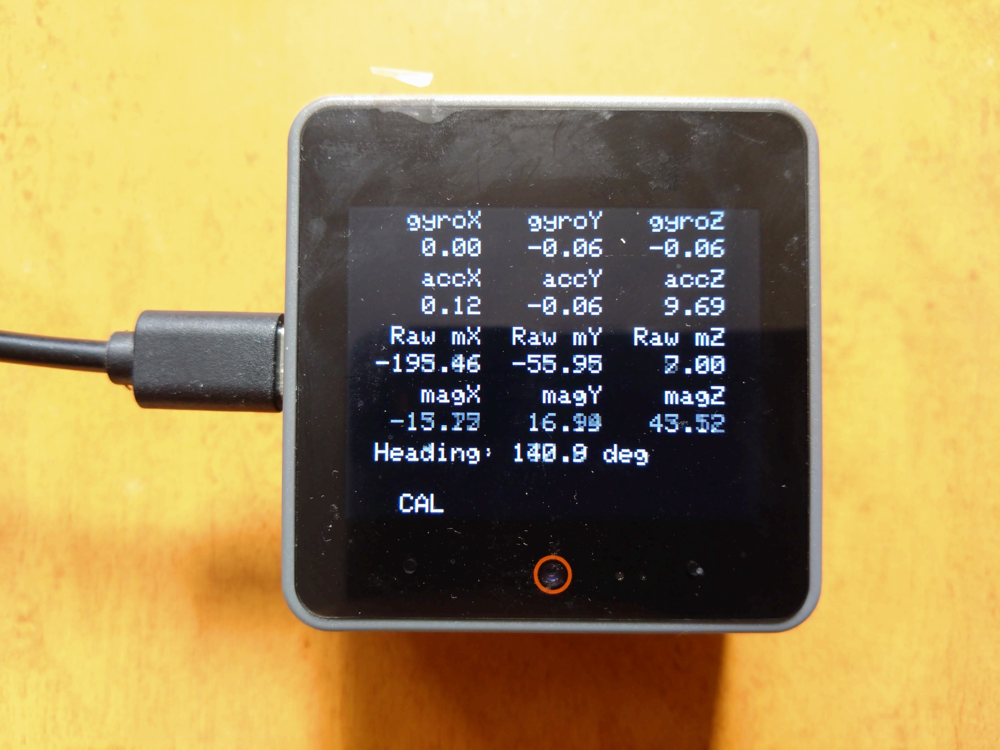
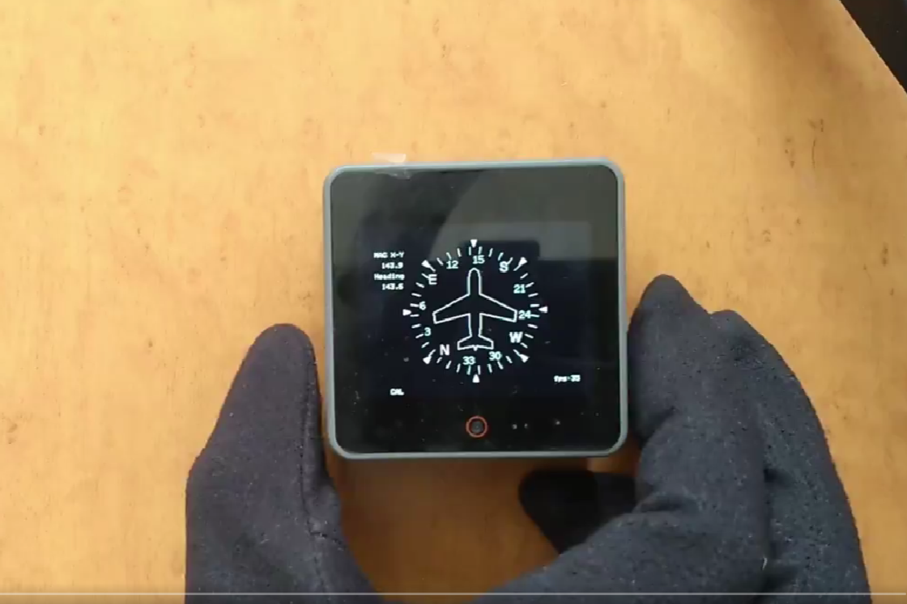
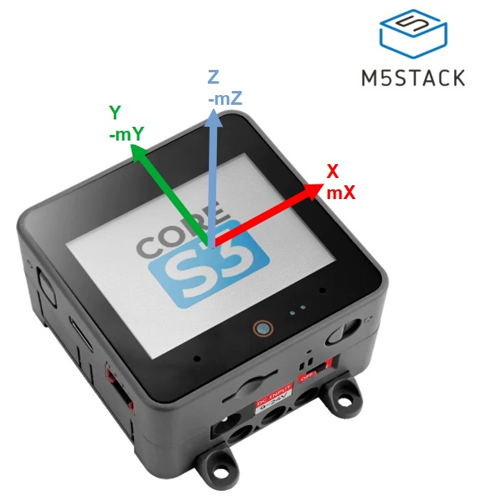
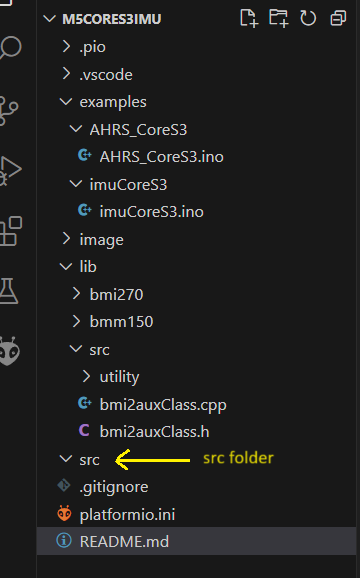

# M5CoreS3-IMU

YouTube
https://www.youtube.com/embed/pA9W0otDkSE

## PlatformIO only (not tested Arduino-IDE)
Copy example code to src folder and rename main.cpp

- Modifed bmm150_defs.h using floating point
~~~
/******************************************************************************/
/*! @name        Compiler switch macros Definitions                */
/******************************************************************************/
#define BMM150_USE_FLOATING_POINT //OK

#ifndef BMM150_USE_FLOATING_POINT /*< Check if floating point (using BMM150_USE_FLOATING_POINT) is enabled */
#ifndef BMM150_USE_FIXED_POINT /*< If floating point is not enabled then enable BMM150_USE_FIXED_POINT */
#define BMM150_USE_FIXED_POINT
#endif
#endif
~~~

## Serial Monitor
To keep the display speed, use M5.Log.Printf instead of Serial or USBSerial

## References
https://github.com/boschsensortec/BMI270_SensorDriver  
https://github.com/boschsensortec/BMM150_SensorDriver  
https://github.com/m5stack/M5Unified  
https://github.com/GOB52/gob_unifiedButton  

## License
- 9PEO0xNd - MIT
- M5Unified - MIT by M5Stack
- gob_unifiedButton - MIT by GOB52
- BMI270 BSD-3-Clause license by BoschSensortec
- BMM150 BSD-3-Clause license by BoschSensortec

## History
2024/Mar/02 Initial release
